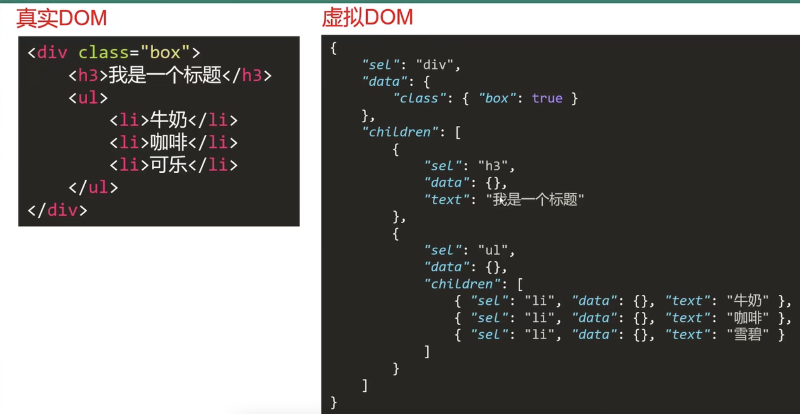
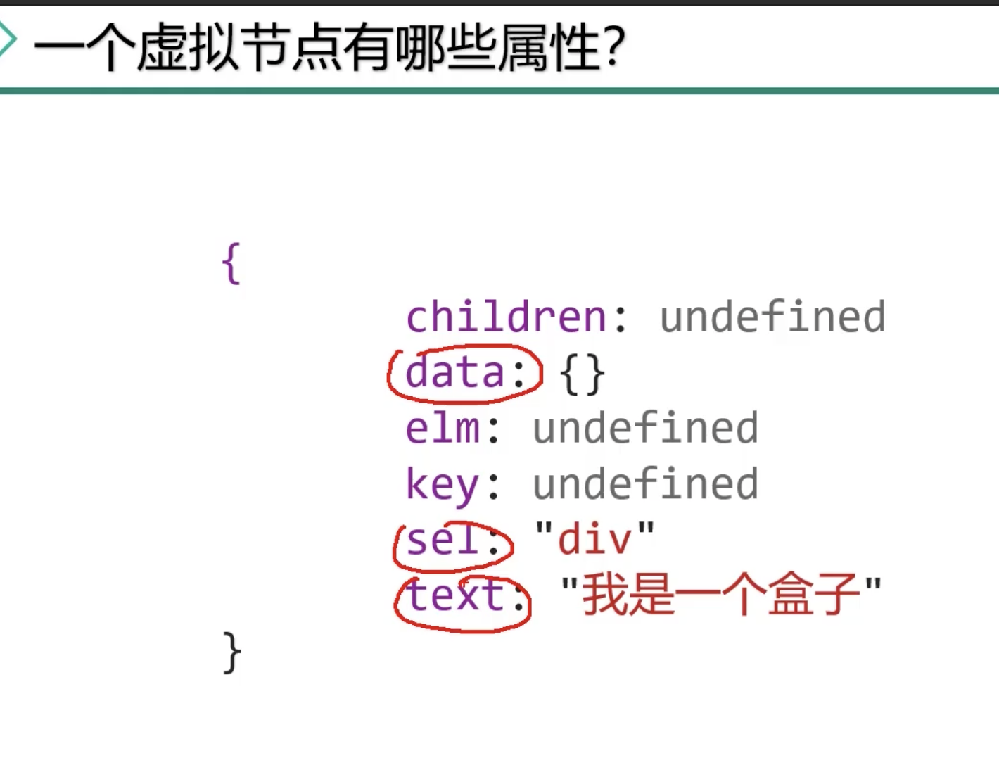
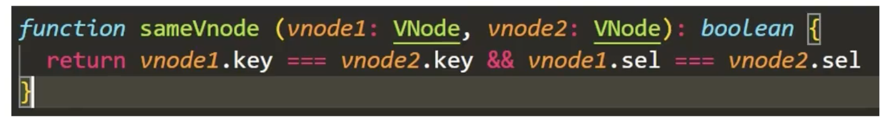
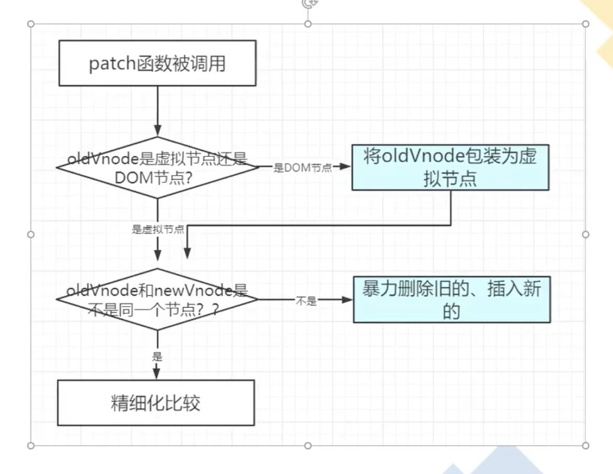
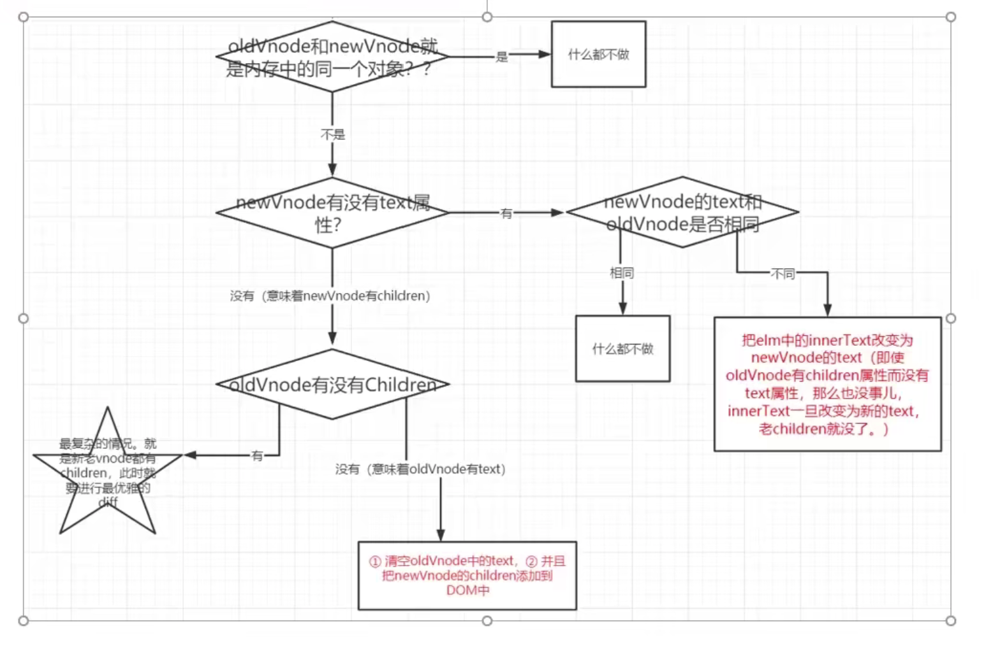

# vue-diff算法过程概述

过程：patch（判断子节点是否为 sameVnode）-> patchVnode（sameVnode 进行对比内容是否相同）-> updateChildren（更新子节点，使用双指针和 key 进行对比更新）

- 数据变化执行setter函数触发 dep.notify()中的update函数后，执行 render function 产生新的虚拟dom，然后和旧的虚拟dom一起传入patch函数，

- 在patch函数中判断是否是同一个虚拟节点sameVNode，如果不是则暴力删除旧的，把新的渲染上去；如果是同个虚拟节点，就传入patchVNode函数中对比子节点，如果内容不同，就执行updateChildren 更新子节点。此过程采用**双指针和key**进行对比更新。**(以旧节点为基础，进行差异修改，增删一些DOM节点)**

  

## 虚拟dom和diff算法

diff算法可以进行精细化对比，实现最小量更新。

虚拟dom的好处是：1、经过diff算法后得出最小的差异量，集中对旧的虚拟dom进行修改，尽可能减少浏览器的回流和重绘。

​									2、创建一个 `vnode` 的成本比较低。

虚拟dom：用**JS对象来描述dom的层次结构以及属性**。
					有tag标签，props，key唯一标识值，children子类，text文本

### vue v-for为什么要加key？

- 判断是否为同个虚拟dom的条件之一

- （**关键！！！**）key是节点的唯一标识，加上key可以提高diff算法效率。 在更新的前后,如果它们是同一个虚拟节点，在它们直接没有变化的情况下是不会对它们进行替换或者变更的，这是vue的一个优化策略。
- 在diff算法中，当新旧节点交叉对比无法匹配时，会通过key值进行对比。并且根据key值识别节点，找到该节点正确的位置。
- 并且如果不加key值，那么vue会选择复用旧节点，会导致旧节点被保留下来，并且每次增删节点会导致整个v-for全部重新渲染，影响性能。

为什么不建议使用 index 做 key?

- 一旦增删节点后，index会重新排序，导致节点绑定的key值也要重新赋值，节点也会重新渲染，影响性能。

- 两个不一样的东西却被误以为是一样的了。

  > 用 index 作为 key 的坏处就是：两个不一样的东西却被误以为是一样的了。好比如你的女友被一个流氓绑架了，然后他男扮女装，冒充成你的女友，而且你竟然还长期未发现， 在他身上消耗了大量的金钱和时间，等到结婚进洞房的时候才发现，我艹，这女友竟然是冒充的，而且还是个男的！
  > 另外，使用 random 作为 key 的坏处是：两个完全一样的东西却被误以为是不一样的了。比如，你女友只是穿上了一套你从来没有见过的新衣服，然后你就坚决否认他是你女友，然后你就跟他分手了，活该单身一辈子！

### 如何定义是同一个虚拟节点？

新旧节点的**选择器相同并且key值相同**！

描述：**diff算法发生在虚拟dom上，新的虚拟dom和老虚拟dom进行精细化比较，从而算出最小量的更新，最后反应在真正的真实dom上。**

注：1、必须是同一个虚拟节点，才会进行精细化比较。

​		2、diff算法只有同层比较，没有跨层比较 ，只有1、2两种情况，否则都会暴力删除旧的，然后插入新的

### diff算法的优化策略 （Vue2.X Diff —— 双端比较）

**理想情况：**

四种命中查找（四个指针策略）

1、旧前与新前，命中后新旧两个头指针向后移动一位

2、旧后与新后，命中后新旧两个尾指针向前移动一位

3、旧前与新后（涉及移动节点，新后指向的节点移动到旧后的后面），命中后新节点的尾指针向前移动一位，旧节点的头指针向后移动一位。

4、旧后与新前（涉及移动节点，新前指向的节点移动到旧前的前面），命中后新节点的头指针向前移动一位，旧节点的尾指针向前移动一位。

依此寻找是否是**同一个虚拟节点**，依次命中，

**非理想情况：**

如果四次对比都没有没有命中，就把**新前所指向的节点**带到**旧节点列表**里遍历，看看是否能找到同个虚拟节点，

- 如果能够找到，就将新前的节点移动到旧的虚拟dom当前的旧前节点之前，并将新前节点在旧节点列表中原来同个虚拟节点置为undefined，最后将新节点列表中的头指针往后移动一位。
- 如果找不到，就在旧前节点列表的前创建一个节点存放新前节点，并将新节点列表中的头指针往后移动一位。

循环停止的条件是当其中一个列表的节点全部遍历完成（或者说尾指针小于前指针）

### Vue 监测变化细粒度把控

- Vue 的响应式系统是中等细粒度的方案，大量的 Watcher 会使内存开销过大，大量 diff 时间太久。所以采用组件 Watcher + 内部 Diff 的方式

  - 在组件级别进行使用 Watcher 进行监测，对 data 进行依赖收集，一旦数据变化，就知道哪个位置发生变化。

  - 然后在组件内部进行 Virtual Dom Diff 算法，获取更加具体节点的差异。	

# Vue3 Diff -- 最长递增子序列