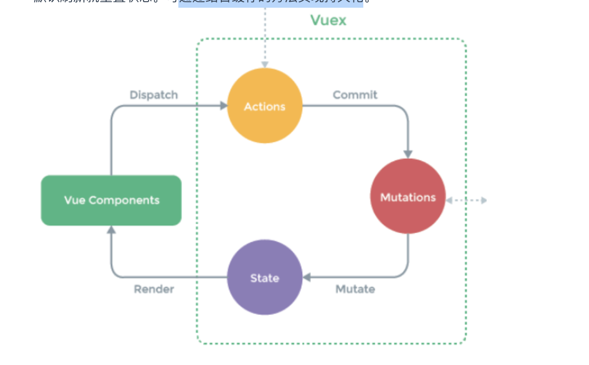

# Vuex

全局状态管理容器，将状态抽离到全局，集中共享管理

特点：单向数据流，响应式，非持久化，默认刷新就重置状态。



使用场景：

- 多个组件依赖于一个数据，当数据发生变化会影响多个组件
- 一个数据的传递需要经过复杂的组件关系

```js
export default new Vuex.Store({
  state: {
    //【状态中心】用于数据的存储，是 store 中的唯一数据源，
	  //【读取方式1】this.$store.state.A
    //【读取方式2】mapState辅助函数，将state混入computed，就可以用this.xxx调用
  },
  getters: {
    //【获取状态】用于数据的筛选和多个数据的相关性计算，接受 state 作为其第一个参数。基于 state 数据的二次包装，如 vue 中的 computed 属性。
		//【属性读取方式】this.$store.getters.B，有缓存性；
		//【方法读取方式】this.$store.getters.fn(arg)，可传参，无缓存性。
    //【读取方式2】mapGetter辅助函数，将getters混入computed，就可以用this.xxx调用
  },
  mutations: {
    //【同步更改状态】改变 state 的唯一途径，接受 state 为第一个参数，Payload 为第二个参数，且不能处理异步事件，如果是两个异步回调的 mutations，就不知道哪个先回调了。
		//【调用 1】通过 commit 调用 handler 处理函数this.$store.commit('xxx', { A:'a' })，commit 第二个参数为载荷 payload，作为参数传入处理函数 xxx 中，xxx(state, payload){}。
		//【调用 2】mapMutations 辅助函数，将 mutation 的处理混入 methods，就可直接使用this.xxx()，会自动转为this.$store.commit('xxx')
  },
  actions: {
    //【异步更改状态】如接口获取最新状态，获取之后再通过调用 mutation 来进而改变 state，而不是直接变更 state。接收一个上下文 context 作为参数，在里面使用 context.commit 方法，可以使用参数解构直接使用上下文的 commit，increment ({ commit }) { commit('increment') }，更简洁。内部可以多个 commit 执行多个 mutation。比如根据接口返回值，决定 commit 哪一个 mutation。
		//【调用 1】this.$store.dispatch('xxx')
		//【调用 2】mapActions 辅助函数，将 action 的处理混入 methods，就可直接使用this.xxx()，会自动转为this.$store.dispatch('xxx')
  },
});
```

- modules：

  - 将 store 分割成模块（module）。每个模块拥有自己的 state、getter、mutation、action，便于维护。
  - 模块内部的 action、mutation 和 getter 是注册在全局命名空间的，这样使得多个模块能够对同一 mutation 或 action 作出响应。可通过添加`namespaced: true`这个属性表示带命名空间的模块。

  ```js
  const moduleA = {
    state: () => ({ ... }),
    mutations: { ... },
    actions: { ... },
    getters: { ... }
  }
  
  const moduleB = {
    state: () => ({ ... }),
    mutations: { ... },
    actions: { ... }
  }
  
  const store = new Vuex.Store({
    modules: {
      a: moduleA,
      b: moduleB
    }
  })
  
  store.state.a // -> moduleA 的状态
  store.state.b // -> moduleB 的状态
  ```

#### vuex 结合 localStorage 持久化数据

- vuex 里数据改变的时候把数据保存到 localStorage 里面
- 刷新后，localStorage 里如果有保存的数据，取出来替换 store 里的 state。