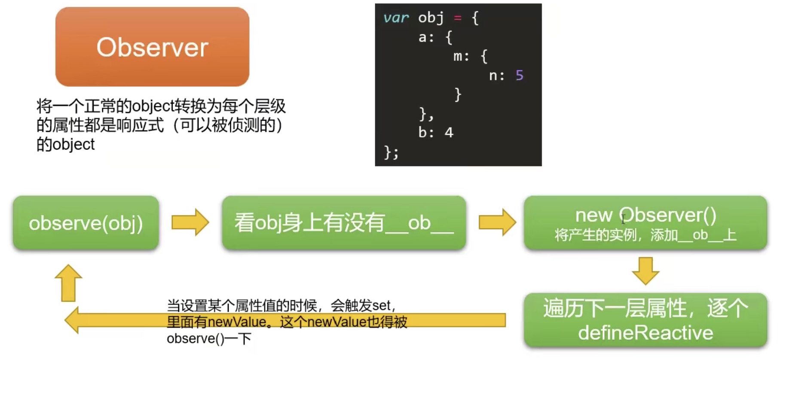
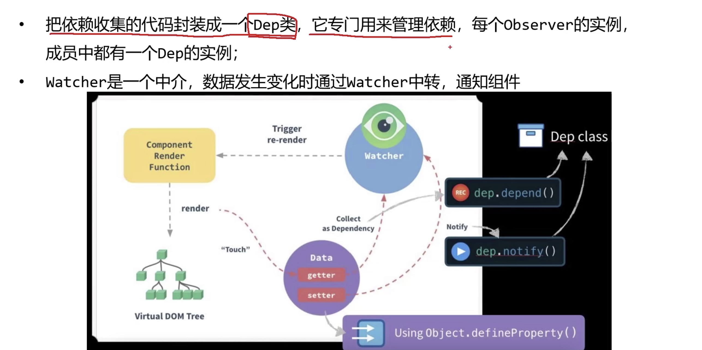
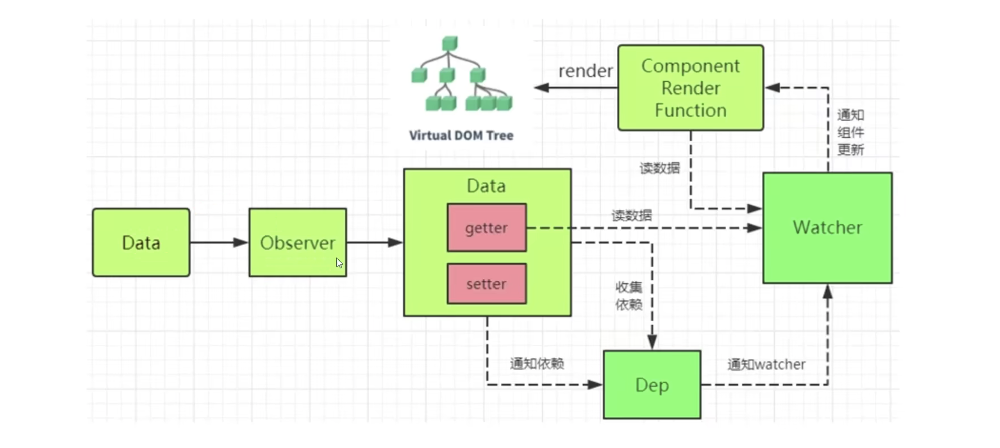
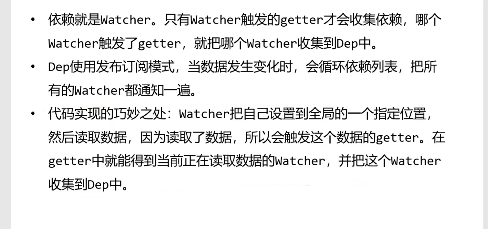
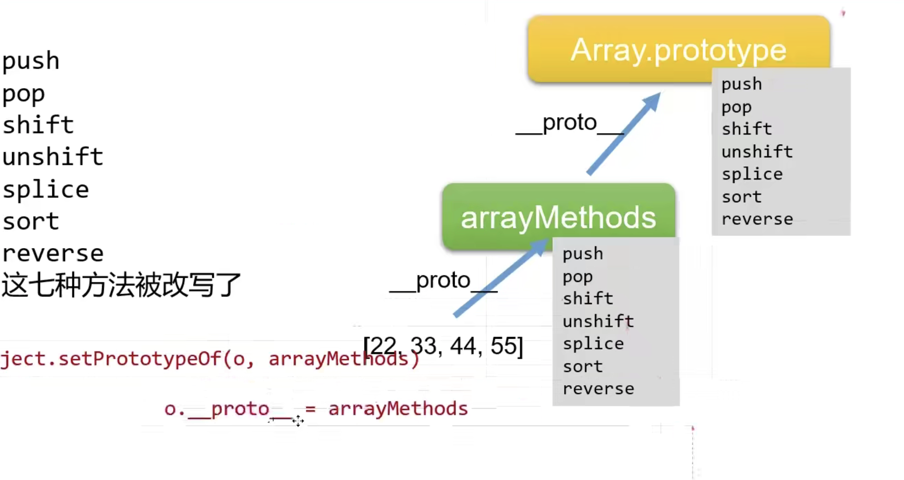

### 响应式数据的实现流程

### vue收集依赖，什么是依赖？

答：需要用到数据的地方就叫依赖，在getter()中收集依赖，在setter()中触发依赖。有了依赖，就可以在数据变化时，只更新与这个数据有关的DOM结构，不至于说任何一个数据变化，都会导致整个页面重新渲染，代价太大。

## 明明是watcher收集依赖,应该是watcher收集数据,怎么成了数据的dep收集watcher了呢？

答：Dep的作用是收集观察者以及当数据发生变化的时候通知观察者watcher去更新。（在每次observe的时候都会给每个实例添加一个属于自己的dep）

watcher观察者相当于中介，为的是通知组件更新

------

### 为什么数据劫持不能监听数组？

答：其实本身是可以的，只是尤大觉得实现的成本太高。毕竟数组是有序的结构，每次新增或者删除某项都会导致每个元素的位置移动，这会触发getter和setter函数，导致依赖发生变化。

- 直接`vm.items[indexOfItem] = newValue`是无法检测到的，length 属性不能监听因为无法触发 obj 的 get 方法。

### **vue数组响应式的实现？**

vue改写了数组的7个方法： push、pop、shift、unshift、splice、sort、reverse。这7个方法都是定义在**Array.prototype**

以**Array.prototype**为原型创建了**arrayMethods**对象，然后用**es6的Object.setPrototypeOf()**（或者`__proto__`）强制改变所需要操作的数组的原型指向arrayMethods

------

> 每个 Vue 组件都有对应的一个 Watcher 实例，如果一个属性在不同组件上都使用到，将把不同组件的 Watcher 都添加到这个属性的 Dep 订阅器中，表示这些视图依赖这个对象属性，如果发生改变，这些视图都要进行更新。一个 Watcher 可能在多个 Dep 中同时存在。

### 依赖收集过程：

**Vue模版编译原理**

> **编译阶段compile**											⬇️**挂载前的准备工作：**
>
> - 查看是否有`<template>`(模板)，内部执行compile函数，解析成`render function`，
>
>   - **compile函数**，包括parse（解析template为**AST**抽象语法树），optimize（标记静态节点，在diff算法执行过程中会跳过这些静态节点，优化点），generate（**AST**抽象语法树 --> render function ）三个阶段。
>     - **AST语法树**：一种用js对象形式描述整个模版template。
>     - 解析阶段：使用大量的正则表达式对模板进行解析，遇到标签、文本的时候都会执行对应的钩子函数进行处理
>     - 优化阶段，模板中有些内容是不需要关联data数据的，首次渲染完就不会再变化的——静态节点，这些内容需要将他们进行标记，等下下次更新模板执行diff算法时就会跳过它们。
>     - 转换阶段：将解析并且优化后的AST语法树转换为可执行的代码render function。
>
> - 模板编译执行`render function`渲染出虚拟dom，**此时还没有生成真实 DOM，因为还没真正挂载。**然后读取模板上插值表达式的值，触发getter函数，执行收集依赖，将订阅者Watcher添加进Dep中。
>
>   （当插值表达式的值发生改变时，会触发setter函数，通知Dep中对应的订阅者Watcher，执行update函数重新渲染页面）

在执行compile函数后，template会被编译成render函数，然后在执行render函数的过程中每个组件会实例化一个watcher对象，实例化工程中就会触发属性的getter函数，从而将这个数据所对应的watcher对象收集各自的依赖管理者dep当中。render 函数的结果便是重新生成 vnode，当这个 render 函数字符串在第一次 mount、或者绑定的数据更新的时候，都会被调用，生成 Vnode。

> 每个 Vue 组件都有对应的一个 Watcher 实例，如果一个属性在不同组件上都使用到，将把不同组件的 Watcher 都添加到这个属性的 Dep 订阅器中，表示这些视图依赖这个对象属性，如果发生改变，这些视图都要进行更新。一个 Watcher 可能在多个 Dep 中同时存在。

------

### 双向绑定的原理描述和总结

当创建 Vue 实例时,vue 初始化会遍历 data 选项的属性，通过Object.defineProperty 为属性添加 getter 和 setter来实现对数据的读取进行劫持（getter 用来依赖收集,setter 用来派发更新）,并且在调用时收集依赖,在属性被访问和修改时通知变化。

每个组件实例会有相应的 watcher 实例,会在组件渲染的过程中进行依赖收集（进行依赖收集,还有 computed watcher,user watcher 实例）,之后依赖项被改动时,setter 方法会通知依赖与此 data 的 watcher 实例重新计算（派发更新）,从而使它关联的组件重新渲染。

一句话总结:

vue.js 采用数据劫持结合发布-订阅模式,通过 Object.defineproperty 来劫持各个属性的 setter,getter,在数据变动时发布消息给订阅者,触发响应的监听回调

------

## computed 的实现原理

#### computed属性初始化

在vue初始化阶段中，当完成了对date属性的数据劫持过程后，也会初始化computed计算属性。

computed 内部实现了一个惰性的 watcher,也就是 computed watcher,每个计算属性都会创建一个computed watcher。在执行render函数时会触发computed属性值的get方法，然后依次将这个计算属性的computed watcher和对应data属性的watcher实例添加到data属性的收集器dep内(**注意订阅队列里的顺序，computed-watcher先，render-watcher后**)。

computed 本质是一个惰性求值的观察者。

其内部通过 `this.dirty `属性标记计算属性是否需要重新求值: 当data属性变化时先调用computed-watcher的update函数然后将this.dirty 置为true，然后再调用render-watcher的update函数重新渲染。

当 computed 的依赖状态发生改变时,就会通知这个惰性的 watcher,

computed watcher 通过 this.dep.subs.length 判断有没有订阅者,

有的话,会重新计算,然后对比新旧值,如果变化了,会重新渲染。 (**Vue 想确保不仅仅是计算属性依赖的值发生变化，而且是当计算属性最终计算的值发生变化时才会触发渲染 watcher 重新渲染，本质上是一种优化。**)

------

Watcher : 观察者对象 , 实例分为`渲染 watcher` (render watcher),`计算属性 watcher` (computed watcher),`侦听器 watcher`（user watcher）
