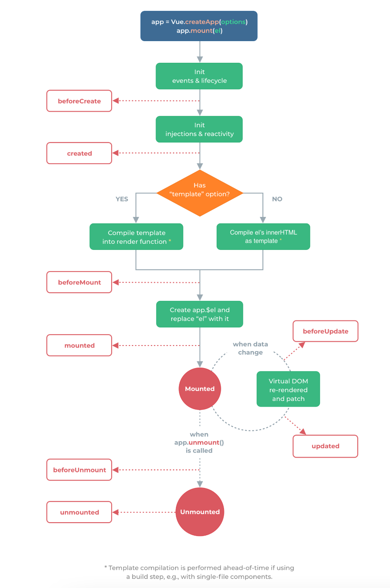
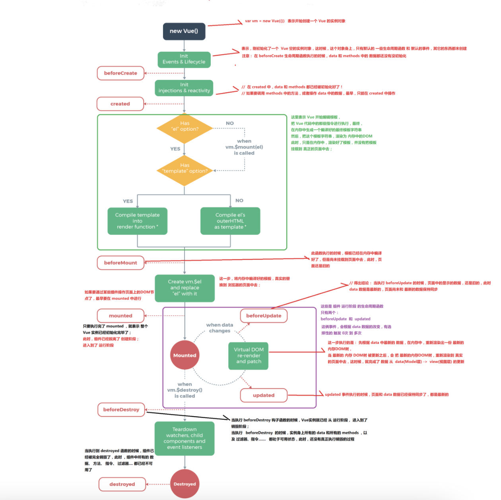
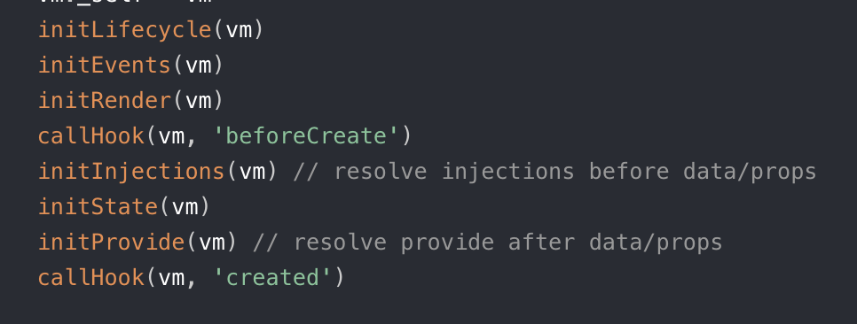
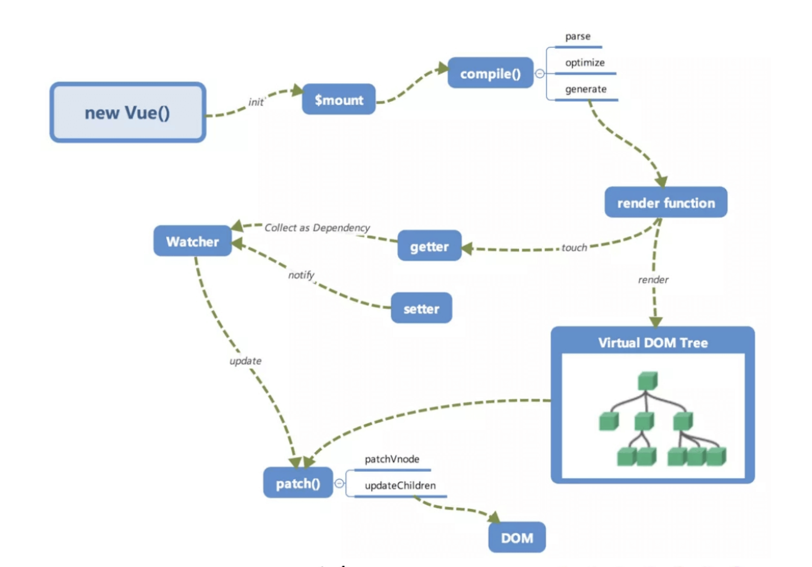

### computed和watch？

答： computed计算属性：

- 需要有**依赖项**，可以不止一个依赖项
- **有缓存**，只有当依赖项发生变化时才会重新执行

- 不能执行异步请求

watch监听器：

- 数据的监听回调函数，当数据发生变化时会执行回调函数
- 可以执行异步请求
- **无缓存性**，当页面重新刷新时，即便监听的值不变化也会触发，可以设置immidiate：false解决
- 可以深度监听对象的属性：deer：true，或者使用字符串形式监听：'object.key': function(n,o){}

**运用场景：**

computed：当需要对某个值进行另外的计算时，避免在模版中放入过多的逻辑，难以维护，而把该值作为依赖项，采取计算属性重新求值。

watch：当需要在数据变化后执行异步请求或者更大开销的操作时，应该使用watch

------

### nextTick的原理？

答：首先vue中，更新DOM时是异步执行的，也就是说当数据发生变化后，视图不是立马更新的，而是等同一个循环中的数据变化完了，进入到下一个循环tick的时候才更新。

**nextTick的目的是在就是在dom更新完后或者说下一个tick触发时，执行回调。**（比如可以用nextTick可以在dom异步渲染结束之后获取改变之后的数据等）

​		**原理及实现方式：**Vue 异步执行 DOM 更新。只要观察到数据变化，Vue 将开启一个队列，并缓冲在同一事件循环中发生的所有数据改变。然后，在下一个的事件循环“tick”中，Vue 刷新队列并执行实际 (已去重的) 工作。**Vue 在内部尝试对异步队列使用原生的Promise.then和MessageChannel，如果执行环境不支持，会采用setTimeout(fn, 0)代替。**

tip：基于事件循环机制，vue用异步队列的方式来控制DOM更新和nextTick回调执行，在事件队列中，微任务 ——> Dom渲染 ——> 宏任务，能确保队列中的微任务在进入下一次循环前执行完毕。

**应用场景：**

- 在create中，对dom的操作这样放在nextTick中执行，因为在执行create时，dom还没挂载上去，此时如果有对dom的操作，就可以放在nextTick的回调中，等到dom渲染完成后，回调函数就会执行
- 在数据变化后，要对一个依赖数据变化的dom元素进行操作

#### 视图更新优化：

​		Vue 视图更新 DOM 是异步执行的，检测到数据有变化，Vue 开启一个异步队列，下个 tick 更新视图。同一个 watcher 被多次触发，只会被推入到队列中一次。

------

## vue 是如何对数组方法进行变异的 ?

答：vue以Array.prototype为基础创建一个新的对象ArrayObj，然后将重写了ArrayObj上的数组方法，最后将所要操作的数组同Object.setPrototype()强制改变数组的原型指向ArrayObj上。这样每个数组上就会有一个携带上它的Observe对象，一旦有新的值，就会调用Observe对象上的observeArray方法对新的值进行数据劫持，并且会手动调用notify方法更新

## Vue 组件 data 为什么必须是函数 ?

答：注册一个组件实质上是创建一个组件实例，而且组件是可以复用的，就会创造出更多的实例。如果组件data是一个对象时，所有组件data都会共享这个对象(即指向同一个内存地址)，导致修改其中一个属性就会影响其他组件上的同个属性。为了防止实例间 data 的冲突，将data设置成一个函数并return出一个对象，让每个组件都能各自维护一份独立拷贝的数据。

##  聊聊 keep-alive 的实现原理和缓存策略

答：缓存原理：1、获取keep-alive包裹着的子组件和组件名，2、根据include/exclude数组里的组件名进行匹配，决定是否走缓存还是直接返回组件实例，3、根据组件ID和tag生成缓存key，然后根据缓存策略对key进行处理。

缓存策略：LRU缓存淘汰算法，核心思想就是如果数据最近被访问过，那么将来被访问的几率就更高，实际是每个组件都有一个key值，每次缓存一个组件都会在缓存数组中对应道组件key给移动到数组的最后面，并且缓存数组是有数量控制的，当达到一定数量后，缓存数组最前面、下标为0的一项会被删除。

###  v-for 和 v-if不能一起用？

答： 涉及到优先级问题，v-for会比v-if优先执行

如果v-if和v-for同一级的话会始终先循环v-for，然后在每个item上加上v-if。这样每个子项都要做一个v-if判断，会造成性能浪费（不会报错，会警告）

解决方法：可以把v-if提到外层去,(可以用template替换div)

```
### **new vue()发生了什么事情？**

答：Vue 初始化主要就干了几件事情，合并配置，初始化生命周期，初始化事件中心，初始化渲染，初始化 data、props、computed、watcher 等等。 <div v-if="boolean">
    <div v-for="(item, idx) in array" :key="idx"></div>
</div>
```

### vue2中数组变化的限制&解决方法

答：vue2检测不了数组的索引和数组长度的变化，原因是数组的下标和value无法固定对应，Object.defineProperty()的方法对数组劫持的实现不太理想，或者无法对数组进行劫持，这个问题在vue3中已经解决，vue2的解决方法是对数组的方法进行重写

解决方法：$set,$detele,以及数组的方法splice。

------

### **v-if和v-show的区别**

v-if：

- 只有在条件为true的时候才会去渲染元素，条件不成立不会生成对应的vnode，render也不会渲染
- 适用于条件很少变化的场景，比如元素的显示和隐藏是一次性决定的那就用v-if

v-show

- 不管条件成不成立，都会生成vnode，render也会被渲染
- 在不满足条件时，元素上增加一个style："display: none"的内敛样式
- 适用于切换频繁的场景

------

### v-cloak

用来解决插值表达式闪烁一下{undefined{obj.name}} 这个vue.js模板变量的问题

```
html:
<ul v-cloak v-for="item in obj">
 <li>{{ obj.name }}</li>
</ul>
css:
[v-cloak] {
     display: none;
}
```
# vue的生命周期

######                           						



#### init：*new vue()发生了什么事情？*



Vue 初始化主要就干了几件事情，合并配置，**初始化生命周期，初始化事件，初始化渲染，初始化 data、props、computed、watcher 等等。 **

在初始化data时，会运行 observe 函数深度遍历数据中的每一个属性，进行数据劫持(Object.defineProperty),实现响应式。

**`beforeCreated`**: 实例刚创建，此时还不能访问methods，data，computed等上的方法和数据，(因为如图中initState初始化data在beforeCreated后面执行)

------

**`created`**: 实例创建完成，属性已经完成数据劫持完成， **`但还未生成真实dom，因为还没有挂载到页面上，`**

​				**可以调用methods里面的方法，data可以访问，可以获取computed中的计算属性等**

------

**`beforeMount`**：挂载之前。

**编译阶段compile**											⬇️**挂载前的准备工作：**

- 查看是否有`<template>`(模板)，内部执行compile函数，解析成`render function`，
  
- **compile函数**，包括parse（解析template为**AST**抽象语法树），optimize（标记静态节点，在diff算法执行过程中会跳过这些静态节点，优化点），generate（**AST**抽象语法树 --> render function ）三个阶段。
  
- 模板编译执行`render function`渲染出虚拟dom，**此时还没有生成真实 DOM，因为还没真正挂载。**然后读取模板上插值表达式的值，触发getter函数，执行收集依赖，将订阅者Watcher添加进Dep中。

  （当插值表达式的值发生改变时，会触发setter函数，通知Dep中对应的订阅者Watcher，执行update函数重新渲染页面）

`.vue`文件: `vue-loader`会将`<template>`编译成`render function`*

**`mounted`**：组件挂载完成，可以拿到挂载对象$el，**真正生成真实dom，data、method 可访问、*el 可访问*。**

mounted只会执行一次。

------

**`beforeUpdate`**：更新前，发生在虚拟 DOM patch之前，在数据更新之前被调用

​																		 ⬇️**更新的过程中：**

数据变化触发 update 后，执行 render function 得到新的 VNode 节点，期间会执行`diff`算法，对比新旧的虚拟节点，得出最小的修改点，仅修改对应的dom节点。

**`updated`**：更新完成。此时，dom已经更新完毕！**如果有 nextTick 回调，会在视图更新后执行。**

------

**`beforeDestroy`**：实例销毁前。

- 这里实例仍然存在，仍然可以用this访问实例，

- 做一些清理工作，如清除计时器，移除绑定了 DOM/BOM 对象中的事件，

------

**`destroyed`**：销毁完成，组件销毁后调用，解绑指令，所有事件监听被移除（重点），所有子组件实例销毁，都不可用。

------

#### **关键节点简述**

- 创建阶段

  - `beforeCreate`：【data、methods、el 均不可访问】
  - 中间执行：初始化 data、methods、props、computed、watcher、provide。
  - `created`：【data、methods 可访问、el 不可访问】【最早可访问 data】
    - 可以执行ajax请求数据

  ```js
  created() {
    // 允许并推荐
    this.$http.get(xxx).then(res => {
        this.data = res.data
    })
    // 不允许
    this.$el
    this.$ref.demo
    const a = document.getElementById('demo')
  }
  ```

- 挂载阶段

  - `beforeMount`：【data、methods 可访问、el 不可访问】【虚拟 DOM 编译还在内存中，还未挂载】
  - `mounted`：【data、methods 可访问、el 可访问】【最早可操作 DOM】【页面已显示】

  ```js
  mounted() {
      // 允许
      this.$el
      this.$ref.demo
      let a = document.getElementById('')
  }
  ```

- 运行阶段

  - `beforeUpdate`：【数据更新后执行】【data 数据是新的，但页面是旧的】
  - 中间执行：`re-render和patch`进行虚拟 DOM 的 diff 和更新渲染
  - `updated`：【视图更新完执行】【data 和页面都是最新的】

- 销毁阶段

  - `beforeDestroy`：【实例的 data、methods、指令完全可用】
  - `destroyed`：【实例的 data、methods、指令都不可用】
  - 触发销毁钩子的方法
    - 手动调用`$destory()`销毁组件实例
    - v-if 与 v-for 指令（v-show 不行）
    - 路由切换、关闭或刷新浏览器

------


【服务器端渲染】：beforeCreate、created，其他不可调用

【异步请求常放在 created】：官方推荐在 mounted 中调用，实际上可以在 created 生命周期中调用（能更快获取到服务端数据，减少页面 loading 时间），如果需要在请求中修改dom，还是在mounted上。 服务端渲染时不支持 mounted，需要放到 created 中。

【最早访问 data】：在 created 钩子中可以对 data 数据进行操作，可以进行 ajax 请求将返回的数据赋给 data。


## Vue3.0的生命周期

| Vue2            | Vue3                 |
| :-------------- | :------------------- |
| `beforeCreate`  | ❌`setup`(替代)       |
| `created`       | ❌`setup`(替代)       |
| `beforeMount`   | `onBeforeMount`      |
| `mounted`       | `onMounted`          |
| `beforeUpdate`  | `onBeforeUpdate`     |
| `updated`       | `onUpdated`          |
| `beforeDestroy` | `onBeforeUnmount`    |
| `destroyed`     | `onUnmounted`        |
| `errorCaptured` | `onErrorCaptured`    |
| -               | 🎉`onRenderTracked`   |
| -               | 🎉`onRenderTriggered` |

------

## vue的渲染过程



> new Vue()调用 init 初始化 -> $mount 挂载 -> compile()编译模板 -> render function -> 响应式系统 -> 视图更新

> 响应式系统：render -> touch -> getter -> Dep 依赖收集 Watcher；setter -> Dep.notify -> Watcher.update() -> patch()进行 diff -> DOM

- 分为四个阶段：初始化、挂载编译、响应式、视图更新
  - 1、初始化：new Vue():调用 init 函数初始化，包括生命周期、事件、props、data、methods、watch 等，还有数据劫持，通过 Object.defineProperty 设置 setter 和 getter 函数(同时将 this.data.test 代理成 this.test)，用于后续的依赖收集和响应式。
  - 2、编译挂载：初始化后调用$mount 挂载组件，有 template 的情况下，内部执行 compile()编译，包括 parse（解析 template 转成 AST） 、 optimize(标记静态节点、用于 diff 优化跳过静态节点) 与 generate（AST -> render function） 三个阶段，最终得到 render function，用来渲染 VNode，然后生成真实 DOM 显示在页面上。
  - 3、响应式：render function 被渲染，读取所需对象的值，触发 getter 函数，执行依赖收集，将订阅者 Watcher 添加 Dep 订阅器中。修改对象的值时触发 setter，通知 Dep 订阅器中的订阅者 Watcher，需要重新渲染视图，然后 Watcher 调用 update 进行更新。
  - 4、视图更新：数据变化触发 update 后，执行 render function 得到新的 VNode 节点，与旧的 VNode 一起传入 patch 进行比较，经过 diff 算法得到「 差异」，根据差异来修改对应的 DOM。

------


 